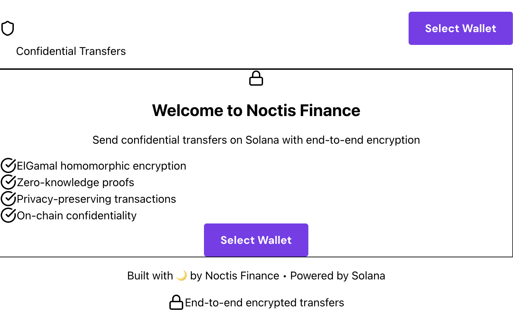
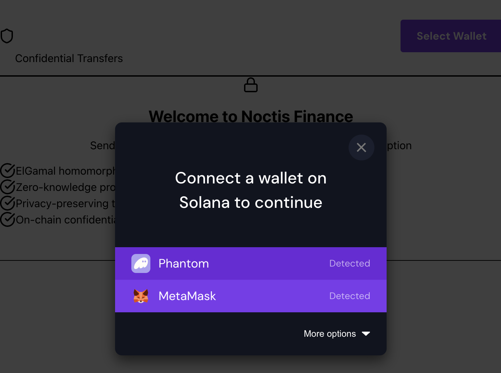
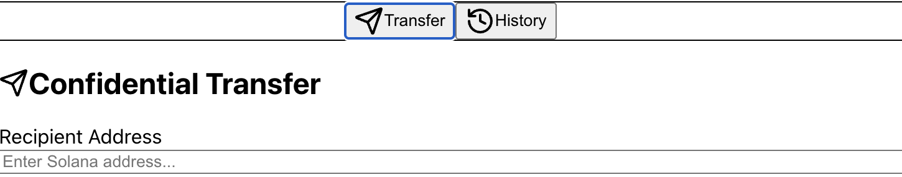
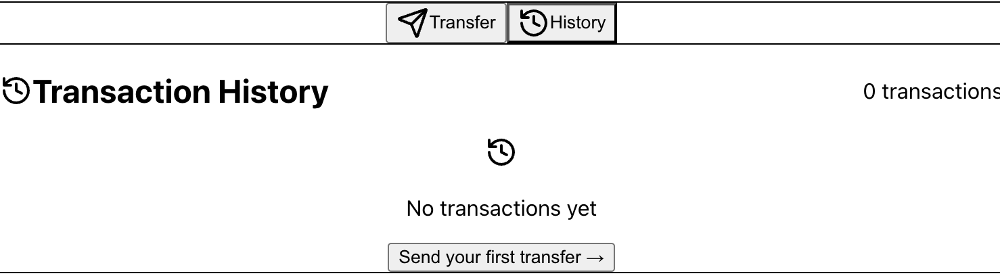
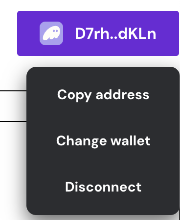

# Noctis-Finance
Noctis - Private transfer PoC using Token-2022 confidential transfers leveraging ElGamal encryptions. 

What is Noctis Finance?
Noctis Finance brings privacy to Solana by implementing confidential transfers using:

-ElGamal Homomorphic Encryption: Amounts are encrypted on-chain
-Zero-Knowledge Proofs: Verify transactions without revealing values
-Anchor Framework: Secure smart contract architecture
-Interface with real-time feedback

Usecases 
Noctis bring transfer rails in a private way. 
-Noctis keep privacy in DeFi for retail and investors avoiding MEV bots. 
-Noctis allow also more institutionnals oriented targets to be onboarded onchain in a private and compliant way. 

Architecture

Transaction Flow
sequenceDiagram
    participant User
    participant Frontend
    participant Wallet
    participant Program
    participant Blockchain

    User->>Frontend: Enter amount & recipient
    Frontend->>Frontend: Encrypt amount (ElGamal)
    Frontend->>Wallet: Request signature
    Wallet->>User: Confirm transaction
    User->>Wallet: Approve
    Wallet->>Program: Send encrypted TX
    Program->>Program: Validate accounts
    Program->>Blockchain: Transfer SOL
    Blockchain->>Program: Confirm
    Program->>Frontend: Return signature
    Frontend->>User: Show success + decrypt option

Demo 
1. Welcome page 

2. Select your wallet 

3. Start a confidential transfer with a recipient address and the amount in SOL that you want to send

4. Review your transaction history

5. Disconnect your wallet or change address 

Getting Started
Prerequisites
# Required versions
node >= 18.0.0
npm >= 9.0.0
rust >= 1.70.0
solana-cli >= 1.18.0
anchor-cli >= 0.32.0

Installation
# 1. Clone repository
git clone https://github.com/[username]/noctis-finance
cd noctis-finance

# 2. Install dependencies
npm install
cd frontend && npm install && cd ..

# 3. Build program
anchor build

# 4. Configure Solana (Devnet)
solana config set --url devnet
solana-keygen new  # If you don't have a keypair

# 5. Airdrop SOL for testing
solana airdrop 2

# 6. Deploy program
anchor deploy

Run Locally
# Terminal 1: Local validator (optional, or use devnet)
solana-test-validator

# Terminal 2: Deploy
anchor build && anchor deploy

# Terminal 3: Frontend
cd frontend
npm run dev

Access at: http://localhost:3000

Testing
# Run all tests
anchor test

# Run specific test
anchor test -- --grep "confidential_transfer"

# Frontend tests (if implemented)
cd frontend
npm test

Test Coverage
✅ Program initialization
✅ Confidential transfer with encryption
✅ Account validation
✅ Error handling (invalid addresses, amounts)
⚠️  ZK proof verification (planned)

Tech Stack
Smart Contract
-Anchor Framework 0.32.0 - Solana program development
-Rust - Systems programming language
-Solana Web3.js - Blockchain interaction

Frontend
-Next.js 16 - React framework with App Router
-TypeScript - Type-safe development
-TailwindCSS - Utility-first styling
-Framer Motion - Smooth animations
-Lucide React - Modern icons
-Sonner - Toast notifications

Wallet Integration
-@solana/wallet-adapter - Multi-wallet support
-Phantom - Primary wallet
-Solflare - Alternative wallet

Roadmap
✅ Phase 1: MVP (Completed)
 Basic confidential transfer
 Wallet integration
 Frontend UI
 Devnet deployment

🔄 Phase 2: Enhanced Privacy (In Progress)
 Real ElGamal implementation
 ZK-SNARK range proofs
 Encrypted balance queries
 Mainnet deployment

📋 Phase 3: Production (Planned)
Explore x402 compatibilty to enchance privacy on web payment
SDK to integrate easily private transfer 
Integration to Arcium to leverage their technical features

Contributing
Contributions welcome! Please follow these steps:

1-Fork the repository
2-Create feature branch (git checkout -b feature/AmazingFeature)
3-Commit changes (git commit -m 'Add AmazingFeature')
4-Push to branch (git push origin feature/AmazingFeature)
5-Open Pull Request

Development Guidelines

Follow Rust best practices
Add tests for new features
Update documentation
Run anchor test before committing

License
This project is licensed under the MIT License - see LICENSE file.

Contact & Links
Developer: maxfeyler
Twitter: @0x_Max_
Demo Video:

Disclaimer
This is an Bootcamp/hackathon project. DO NOT use in production without:

-Professional security audit
-Comprehensive testing
-Legal compliance review
-Insurance/risk management

Some changes may happen as the project is currently under development. 

Built with ❤️ for the Solana ecosystem
